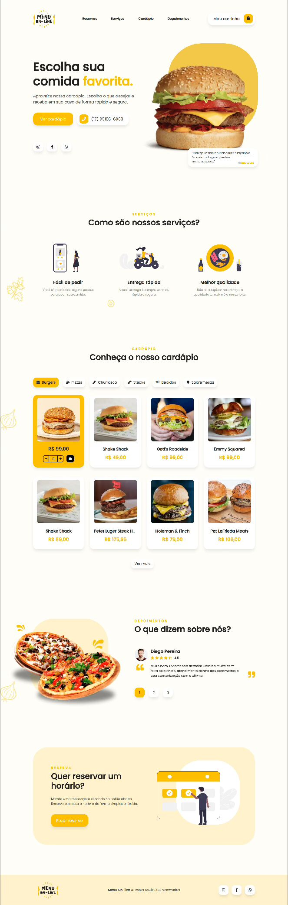

<h1 align="center">Menu Online - Alllisson Andrade 💻</h1>

<h4 align="center"><a href="https://menu-online-projeto.000webhostapp.com/">Confira o projeto aqui</a></h4>

---

## 💻 Sobre

Este projeto é um cardápio online interativo que permite aos usuários visualizar e selecionar itens do cardápio, adicioná-los ao carrinho e finalizar o pedido. Desenvolvido utilizando HTML, CSS e JavaScript, faz uso do framework jQuery para interatividade dinâmica na página. Além disso, integra a biblioteca WOW.js com o framework Animate.css para adicionar animações suaves aos elementos da interface, proporcionando uma experiência de usuário mais envolvente e atrativa.

## 🧠 Tecnologias utilizadas:

O site **ainda está em desenvolvimento**, pois estou em constante aprendizado. Mas até aqui utilizei as tecnologias:

    
    
    

## 📚 Alguns conceitos aplicados

Neste projeto apliquei os seguintes pontos:
+ Semântica HTML;
+ Pontos de acessibilidade;
+ Responsividade;
+ Mobile first;
+ Utilização da lib JS <a href="https://scrollrevealjs.org">Scroll Reveal</a>.

---

<table>
  <tr>
    <td>
      
    </td>
    <td>
      Feito por <a href="https://github.com/allissonandrade">Allisson Andrade.</a> 🙋🏿‍♂️
    </td>
  </tr>
</table>
